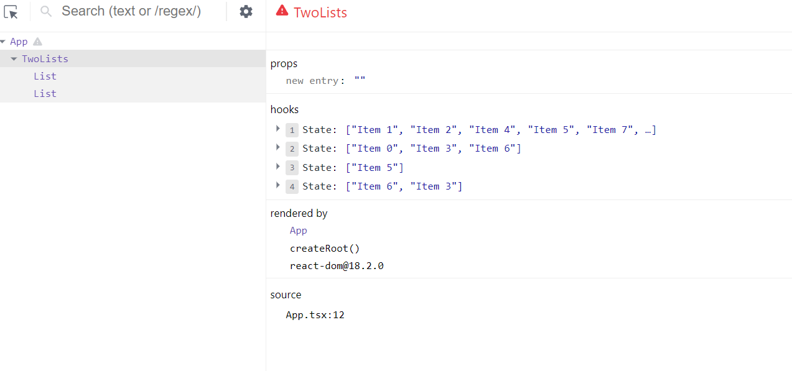
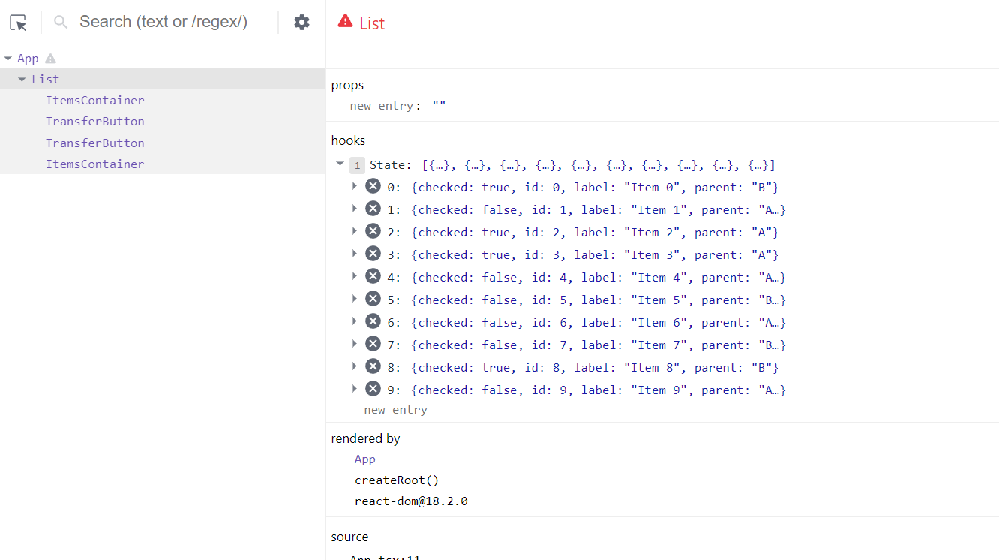

- Zadanie działa, bez żadnego buga :1010:
- Zrobiłeś tak, że po przeniesieniu rzeczy checkbox znika - więc poprawiłeś nawet UX :muscle:
- Kod jest czytelny, fajnie wydzielone funkcje, wiadomo co się dzieje.

Uwagi:

- Masz kilka osobnych zmiennych stanowych, które musisz bardzo skrupulatnie ze sobą koordynować.
- Jeżeli coś miałoby się zmienić w wymaganiach, to będziesz musiał sprawdzić i poprawić wiele miejsc.
- Trzymasz stan aplikacji w rodzicu, i tam też go zmieniasz - to jest spoko, ale to rozdrobnienie na...
  - elementy w liście a
  - elementy w liście b
  - elementy zaznaczone w a
  - elementy zaznaczone w b

... trochę zwiększa złożoność i może być powodem powstawania bugów w kodzie.

Skoro już trzymasz ten stan w rodzicu, to może spróbuj go zgrupować razem.

- niech stan to będzie tablica twoich elementów listy
- niech każdy element listy posiada info na temat tego jaką ma wartość, do której listy obecnie przynależy, i czy jest obecnie zaznaczony

zamiast:



spróbuj:



Przydatna sekcja w docsach: https://react.dev/learn/choosing-the-state-structure#principles-for-structuring-state

Jeszcze jedna mała uwaga, fajnie jest wynieść typy proposów na góre:

```tsx
type ListProps = {
  title: string;
  items: string[];
  selected: string[];
  handleCheckboxChange: (
    event: React.ChangeEvent<HTMLInputElement>,
    item: string,
  ) => void;
};

function List(props: ListProps) {...}
```

Bo im tego jest więcej to potem trudniej się to czyta.

BTW, jak będziesz potem zmieniał ten stan, to kopiowanie nested obiektów może się robić uciążliwe. Możesz np. użyć biblioteki immer: https://react.dev/learn/updating-objects-in-state#write-concise-update-logic-with-immer która pod spodem tworzy proxy i pozwal Ci "mutować" stan.

Więc nie musisz się potem bawić w `{...item, checked: ...}` tylko możesz zrobić `item.checked = ...`

Ale to tak na marginesie, tutaj akurat nie ma źle z tym kopiowaniem, ale na przyszłość.
