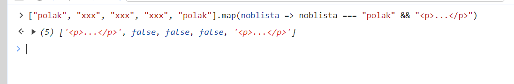
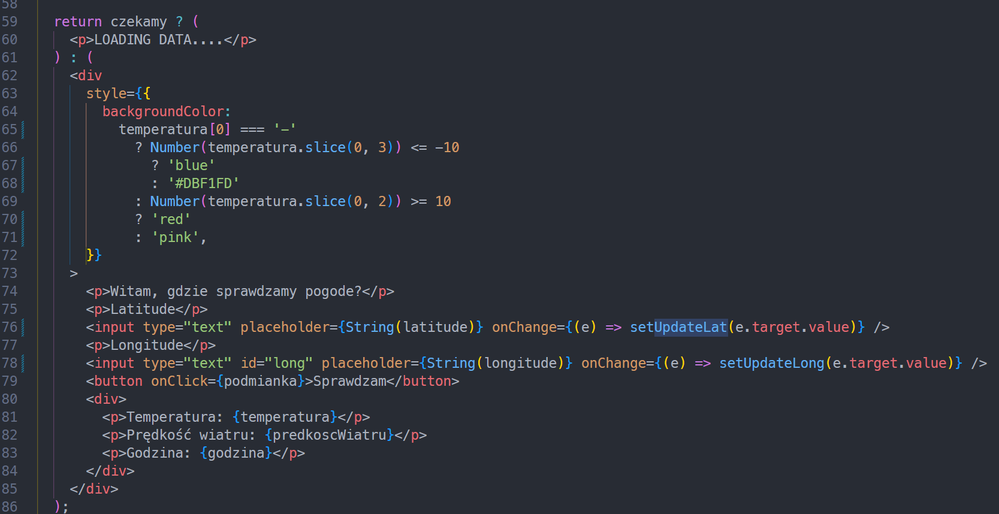

https://github.com/Wexoss/knurcamp/tree/main/zadania%20dodatkowe/zadania-dodatkowe/src/components, z ta sygnalizacja V3, żeby się zmieniało jeszcze(wrócę do tego ze świeżą głową) sobie nie poradziłem, później do tego wrócę. Te z gwiazdką też później będą atakowane xdd

SYGNALIZACJA V1.

- Zamiast ignorować eslinta żeby przykryć problem, warto się zastanowić dlaczego występuje błąd/ostrzeżenie. Jako że zmienna kolory to tablica, to w każdym nowym renderze tworzy się referencja do nowego obiektu, ponieważ ["a", "b", "c"] !== ["a", "b", "c"] (typ złożony) więc useEffect zawsze będzie się odpalał (mimo tego, że ta tablica kolorów "nie zmienia swojej wartości" to w każdym nowym renderze jest zupełnie nowym obiektem.)

Żeby uniknąć tej zagwozdki, mógłbyś np. wynieść kolory poza komponent, wtedy eslint się uspokoi.

- Nie ma w sumie potrzeby, żeby w tym `useEffect` były aż trzy zależności: 1. kolory, 2. index, 3. kolor, patrz dalej :point_down:

- Masz nadmiarowe informacje w stanie...

```ts
const [color, setColor] = useState("red");
const [index, setIndex] = useState(1);
```

...przez co musisz koordynować te wartości ze sobą. Tak naprawdę potrzebujesz tylko informację na temat aktualnie "aktywnego indexu".

Twój stan i efekt mogłyby wyglądać tak:

```tsx
  const [activeIndex, setActiveIndex] = useState(0);

  useEffect(() => {
    const lastIndex = kolory.length - 1;

    const interwal = setInterval(() => {
      setActiveIndex(activeIndex === lastIndex ? 0 : activeIndex + 1);
    }, 3000);
    return () => clearInterval(interwal);
  }, [activeIndex]);

...

 <p className="czerwone" style={{ backgroundColor: kolory[activeIndex] === 'red' ? 'red' : 'white' }}></p>
...
```

---

SYGNALIZACJA V2

- podobne uwagi co w v1

Jeśli masz warunek tego typu

```ts
if (index === 2) {
  setIndex(0);
}
```

To fajnie by było nie kodować tego "na sztywno" tylko wyciągnać te 2 programatycznie (np. na podstawie długości tablicy). Tutaj wiadomo, że to jest oczywiste, ale w innym przypadku łatwo doprowadzić do buga. Poza tym, jak coś by się potem miało zmienić (np. długość tablicy) to musisz pamiętać, żeby ręcznie zmienić ten warunek.

---

SYGNALIZACJA V3

Podpowiedź:

Jeśli masz jakiś komponent, który ma stan, np

```tsx
function Counter() {
  const [count, setCount] = useState(0)
  ...
  return <button onClick={handleClick}>{count}</button>
```

}

A potem wyrenderuesz kilka takich komponentów:

```tsx
function App() {
  return (
    <>
      <Counter />
      <Counter />
      <Counter />
    </>
  );
}
```

To ich stan będzie **niezależny**

Stan deklarowany w komponencie jest lokalny dla tego komponentu. Wystarczy, że zrobisz jeden dobrze działający komponent sygnalizacji, i potem po prostu wyświetlisz jego 5 (lub dowolną ilość) instancji koło siebie.

---

POLSCI NOBLIŚCI V1

- w zadaniu była mowa o wyświetleniu wszystkich, nie tylko polskich, ale to szczegół, jest gites :ok_hand:
- używanie indexu jako klucza nie jest dobrą praktyką, tutaj akurat nie ma to znaczenia w tym przykładzie, ale dobrze by było użyć np. imienia lub, dopisać każdej osobie id-ka

---

POLSCI NOBLIŚCI V2

- duplikujesz 95% logiki w tych dwóch mapach, jedyna różnica to `=== "Polish"` vs `!== "Polish`

- do filtrowania danych powinieneś użyć metody filter, a nie map
  Używając map tak naprawdę NIE filtrujesz danych 👇



Jedyny powód dla którego to u ciebie działa jest to, że react nie renderuje wartości `false` w DOM.

- ta sama uwaga jeśli chodzi o używanie indexu tablicy jako klucza.

---

LISTA KSIĄŻEK V1

Podobna uwaga co nobliści. Takie "pseudo filtrowanie" za pomocą `.map` jest nienaturalne i wydaje się bardzo "hacky".

- przefiltruj najpierw te dane za pomocą `filter`
- przemapuj i wyświetl za pomocą `map`

```tsx
const filteredBooks = books.filter(...)

return <>{filteredBooks.map(...)}</>
```

---

POGODA V1

- Nie jest dla mnie jasne dlaczego w `czyPizga` masz `setTimeout` z opóźnieniem `3250`. Zakładam, że chcesz skoordynować ten alert, żeby pojawił się w konkretnym momecie - nie powinieneś tak robić.

Ogólnie to alert to tzw. "side effect", więc powinieneć to ogarnąć w (osobnym) `useEffect` który właśnie jest do ogarniania tego typu rzeczy:

```tsx
useEffect(() => {
  if (temp > -10) return;
  alert("ale pizga");
}, [temperatura]);
```

- Zamiast używać tego ternary tutaj:
- 

Mógłbyś rozważyć zwykłego ifa:

```tsx
if (czekamy) {
 return <p>LOADING DATA</p>
}

return ...
```

ułatwia to czytanie kodu

Ogólnie mógłbyś też poprawić nazywanie zmiennych. Możesz sobie dawać jakieś bekowe nazwy for fun, ale fajnie jakby np. zamiast danePogodowe nazwałyś funkcję np. pobierzDanePogodowe, bo danePogodowe sugeruje, że to jest jakaś zmienna, która trzyma jakąś dane, a to tak naprawdę funkcja która coś robi.
Mógłbyś też zgrupować ten stan, bo jest ze zobą mocno powiązany. Zamiast sie rozdrabniać, na temperature, wiatr, godzine, mógłbyś stworzyć jedną zmienną stanową typu: danePogodowe - https://react.dev/learn/choosing-the-state-structure#group-related-state
